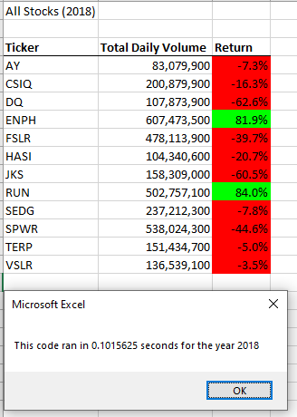

# stock-analysis

## Overview of Project: 
With a click of a button, Steve can now analyze an entire dataset for the stock market over the last few years. We've worked on refactoring VBA code in order for a shorter execute time.  

## Results: 
Looking at the stock data from 2017 and 2018 it looks as though 2017 was a better year for return for majority of the stocks. Using the refactored script the code runs quicker than the original script. Now that the code is running within one macro its run quicker. 

Using images and examples of your code, compare the stock performance between 2017 and 2018, as well as the execution times of the original script and the refactored script.

##Summary: In a summary statement, address the following questions.
###Advantages
###Disadvantages
What are the advantages or disadvantages of refactoring code?
How do these pros and cons apply to refactoring the original VBA script?
